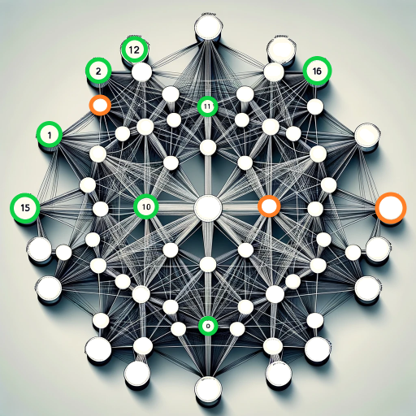

# Data Science Challenge
Transductive Learning with Graph Neural Networks. Second place in a closed Kaggle Competition. Team project between me and [Trantalidis Giannis](https://github.com/johnTrs).

**Keywords:** Graph Neural Networks, Deep-walk, GCN, GAT, GraphSage, Link-Prediction, Transformers, Bert, Automatic Word Tokenization, Greeklish-to-Greek Transliteration, OpenAI API.

## 🕸 Project - Node Classification

The goal of this project is to classify Greek domain names into predefined categories. This task, known as node classification, involves predicting the category of each domain based on its attributes and relationships within a web graph and its textual content.

- **Presentation**: [PDF](https://github.com/FoivosM/MSc-Projects/blob/master/Data_Science_Challenge/1.presentation.pdf)
- **Report**: [PDF](https://github.com/FoivosM/MSc-Projects/blob/master/Data_Science_Challenge/0.report.pdf)

