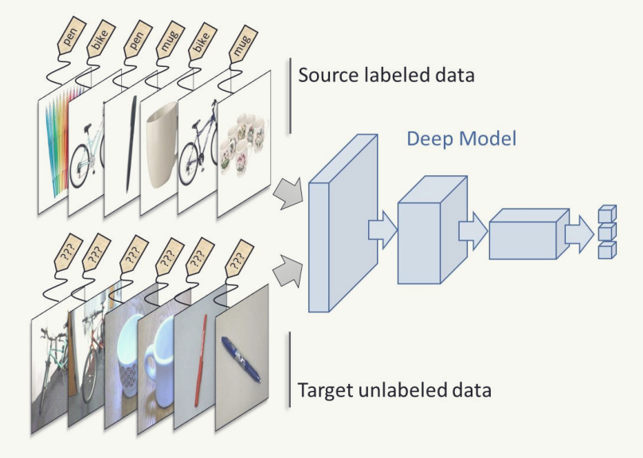

# Deep Learning
Deep Domain Adaptation using Transfer Learning with Contrastive Loss for Image Classification.

**Keywords:** Deep Domain Adaptation, DANN, Adversarial Training, image classification, Office-31, SVHN, MNIST.

## 📷 Project - Domain Adaptation
This project investigates the effectiveness of Domain-Adversarial Neural Networks (DANN) for unsupervised domain adaptation, comparing it against baseline models. DANN utilizes adversarial training to align feature distributions between source and target domains, enhancing model generalization. Results indicate DANN’s superior performance, though the training duration significantly impacts outcomes, with extended training risking overfitting. Attempts to replicate the CORAL method revealed mixed results, underscoring the complexities of domain adaptation.

- **Code**: [SVHN-to-MNIST](), [Amazon-to-Webcam]()
- **Presentation**: [PDF]()
- **Report**: [PDF]()

