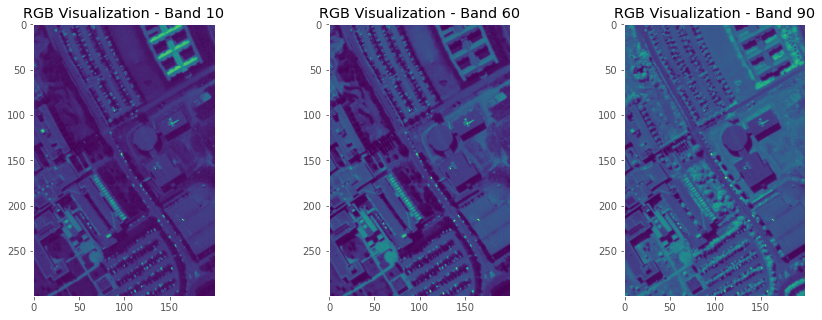

# Machine Learning and Computational Statistics
Enhancing Material Classification in satellite HSI: Regression Algorithms and Classifier Efficiency Assessment.

**Keywords**: Least-Squares, Constrained Least-Squares, Least-Squares with regularization, LASSO, naïve Bayes, minimum Euclidean distance, k-nearest neighbor classifier, Bayesian classifier, cross-validation.

## 🛰 Project - HSI processing

This project is devoted to the processing of hyperspectral images, specifically focusing on spectral unmixing (SU) as a precursor to material label extraction.  Our project aims to assess the performance of various regression algorithms in SU for extracting accurate labels of materials within the Pavia University dataset. Subsequently, these extracted labels serve as the basis for creating diverse classifiers, the efficiency of which is rigorously evaluated in material classification. The most effective classifier is then deployed operationally across different landscapes sharing common materials.

- **Code**: [Code]()
- **Report**: [PDF]()